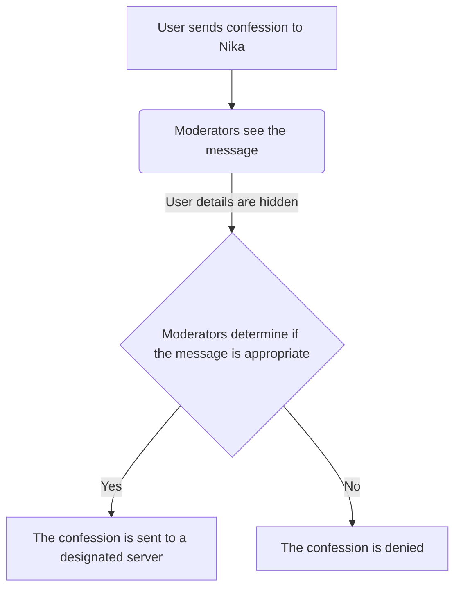

---


# Setup
### Simplified flowchart of how it works:



### Important Reminder:
You will need to host Nika | Confessions bot yourself.
Recommendations for hosting:
- Google Web services (free)
- Heroku (paid)
- AWS

## Requirements
node.js (v.16.17.0)
npm (v.16.0.2)
dotenv (v.16)
discord.js (14.3.0)

Optional: An GoogleAPI account for storing a confession counter. You could keep a local variable that does just this, but the confession counter most be manually updated for any new instance of the bot. This can cause problems, for example, if the bot needs to be taken down for updates.

### These requirements aren't strict - the bot will work with less recent versions
---

## Usage


Run this code in terminal at local directory (where you kept the project):
```npm install discord.js dotenv```


## Deployment


# FAQ

# Attributions

