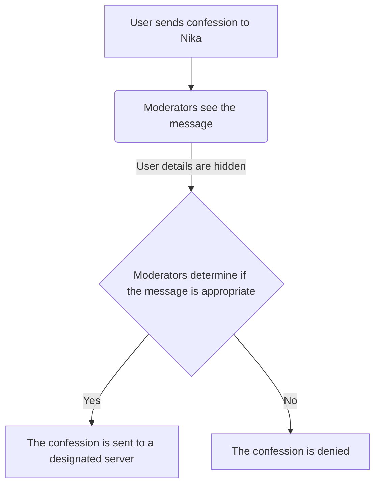

# Setup
How it works:

```mermaid
graph TD
    A[User sends confession to Nika] -->B(Moderators see the message)
    B --> |User details are hidden| C{Moderators determine if the message is appropriate}
    C -->|Yes| D[The confession is sent to a designated server]
    C -->|No| E[The confession is denied]
```

## Requirements
Node.js (1.13.1)

## Usage

## Installation + Deployment

# FAQ

# Attributions

