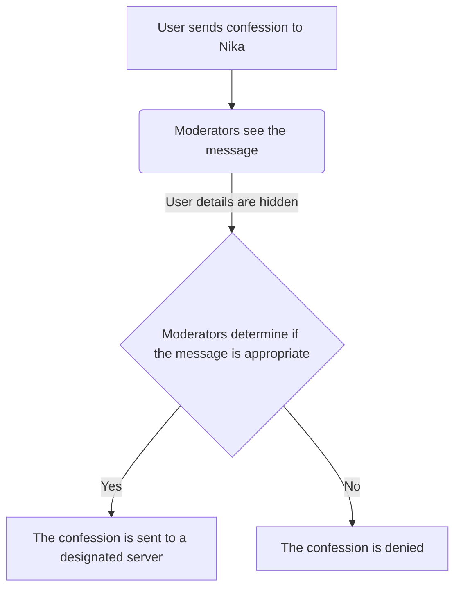

# What is it?
## Completely Anonymous • Messages approved by moderators • Discord Embeds + Image support
Nika | Confessions allows servers to have an outlet for all the the juicy things that can't be said (written) out loud! Though worry not, Nika also comes with a easy-to-use GUI that lets moderators and admin to approve/deny confessions (confessionista details hidden of course)


# Setup
### Simplified flowchart of how it works:



## Video demonstration: [https://www.youtube.com/watch?v=Ythwfm46YKQ](https://www.youtube.com/watch?v=Ythwfm46YKQ)
Note some feautures have been modified since the video was made (new commands + a much better looking '/help' response!)

## See for yourself!
The Nika Bot is active on the UBC 25' ENG server, with over 500 confessions at the time this was written. It's a public server that's open to anyone! Check out the latest version of Nika by joining here: [https://discordservers.com/server/799536262604128267](https://discordservers.com/server/799536262604128267)

### Important Reminder:
You will need to host Nika | Confessions bot yourself.

Recommendations for hosting:
- Google Web services (free)
- Heroku (paid)
- AWS

## Requirements
node.js (v.16.17.0)

npm (v.16.0.2)

dotenv (v.16)

discord.js (14.3.0)


Optional: An GoogleAPI account for storing a confession counter (which uses Google sheets). You could keep a local variable that does just this, but the confession counter must be manually updated for any new instance of the bot. This can cause problems, for example, if the bot needs to be taken down for updates.

### These requirements aren't strict - the bot will work with less recent versions
---

## Installation + Deployment
1. Download all the files as a ZIP (go to `Code` -> `Download as ZIP`)
2. Extract all files
3. Get An API key for your bot and place into the .env folder under KEY
    * This is also a good time to setup your GoogleAPI so the bot can interact with it
4. Run this code in terminal at local directory (where you kept the project):
```npm install discord.js dotenv```
5. Deploy on your hosting service (use web worker node index.js)

Finally check if the bot is online on the server!

### If you did decide to use the GoogleAPI, you will need to configure crenditials.js
[Here is a helpful link: https://www.youtube.com/watch?v=P16uA1Hl4DI](https://www.youtube.com/watch?v=P16uA1Hl4DI)

## If you're new to discord.js, follow this YouTube tutorial series
[https://www.youtube.com/watch?v=JMmUW4d3Noc&t=414s](https://www.youtube.com/watch?v=JMmUW4d3Noc&t=414s)

# Q&A

```I don't want to use GoogleAPI & Google Sheets to keep track of the confession counter, how do I disable?```

> You will have to maually delete API calls to Google and configure `num_deny` and `counter` to not depend on the GoogleAPI feauture. I will release a new version soon that will have this already done!

```The bot is offline```
> This could be due to a number of reasons: invalid API key, your hosting service not running `node index.js`, and a whole bunch more. I would reccomend going into your hosting services error log to see if there are any warnings. If they orginate from your end, try to fix them (StackOverflow is your best friend!), and if you think it's a problem with the bot, send a bug notifications here!

```How do users send images?```
> Currently, the img-url only accepts web-urls and is an optional parameter in the `/confess` command. In the future, I plan to make it so that user can send attachments instead.

```Does the bot support emojis in text```
> Yes, anything that shows up on discord will show up in the confession.

# Attributions
Creative Commons Non-commericial license

If you have any new feauture you would like to add, fork this repo and send in a pull request!
